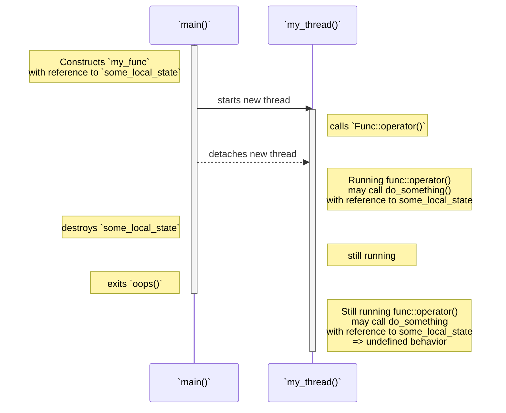

# C++ Concurrency in Action (2nd Edition)

## Highlights from Chapter 02 - "Managing threads"

### Most-vexing parse
> _"If you pass a temporary rather than a named variable, the syntax can be the same as that of a function declaration, in which case the compiler interprets it as such, rather than an object definition"_ – pg. 18, e.g. ...

```cpp
// declares a my_thread function that takes a single parameter...
// ...(of type pointer-to-a-function-taking-no-parameters-and-returning-a-background_task-object)...
// ...and returns a std::thread object, rather than launching a new thread
❌: std::thread my_thread(background_task());
```
```
Parentheses were disambiguated as a function declaration
Member reference base type 'std::thread (background_task (*)())' is not a structure or union
```
This can be _circumnavigated_ by using either extra surrounding parentheses or by using the new uniform initialisation syntax aka curly braces.
```cpp
✅: std::thread my_thread( (background_task()) );
✅: std::thread my_thread{background_task()};

// this also works, but wasn't listed in the examples
✅: std::thread my_thread(background_task{});
```
We can avoid the most-vexing parse entirely by using lambda's.
```cpp
✅: std::thread my_thread( [] () { std::cout << "woof\n"; } );
```

#
### Should I stay or should I go?
Plenty of golden nuggets in this book so far.
> _"Once you’ve started your thread, you need to explicitly decide whether to wait for it to finish (`.join()`) or leave it to run on its own (`.detach()`)."_<br>
> _"If you don’t decide before the std::thread object is destroyed, then your programme is terminated (the `std::thread` destructor calls `std::terminate()`)."_<br>
> _"It’s therefore imperative that you ensure that the thread is correctly joined or detached, even in the presence of exceptions."_<br>
> – pg. 18

#
### Accessing a local variable with a detached thread after it has been destroyed
I came across [__Mermaid__](https://mermaid.js.org/syntax/sequenceDiagram.html) while trying to look for a simple bar chart markdown a while back (please share if you know of one!).

I wasn't successful with the bar chart, but Mermaid seems like a good match for writing out the flow of a multithreaded programme.

[oops.cpp](oops.cpp)

So many important tidbits in these paragraphs - a lot to take in:
> _"One common way to handle this scenario is to make the thread function self-contained and copy the data into the thread rather than sharing the data."_

> _"If you use a callable object for your thread function, that object is copied into the thread, so the original object can be destroyed immediately."_

> _"But you still need to be wary of objects containing pointers or references, ..."_<br/>
> _"In particular, it’s a bad idea to create a thread within a function that has access to the local variables in that function, unless the thread is guaranteed to finish before the function exits."_

> _"Alternatively, you can ensure that the thread has completed execution before the function exits by joining with the thread."_ – pg. 20

#
### Waiting for a thread to complete
We can use `.join()` instead of `.detach()`, but be mindful that it is a one-trick pony, and can be called only once i.e. `joinable() == false`.

[waiting_game.cpp](waiting_game.cpp) | [raii.cpp](raii.cpp)

The author raises a valid point about reverse-order deconstruction (rewinding the stack) when execution of the current thread reaches the end of `f`.

In `raii.cpp`, the copy constructors are marked as `delete` to prevent compiler synthesisation:

> _"Copying or assigning such an object would be dangerous, because it might then outlive the scope of the therad it was joining."_ – pg. 22

> _"If you don't need to wait for a thread to finish, ...[detach] it.<br/>This...ensures that `std::terminate()` won't be called when the `std::thread` is destroyed, even though the thread is still running in the background."_ – pg. 22

#
### Detached threads
> _"Detached threads are often called daemon threads"_ – pg. 23

Detached threads are great for the likes of the following:
* Longer-lasting processes
* Filesystem monitoring
* Cache clearers
* Data structure optimisers

In order ot detach a thread, it must be a-ttached to another; same goes for `join()` - `.joinable()` must be set to `true`.

[word_processor.cpp](word_processor.cpp)

#
### Passing arguments
We need to be especially mindful of passing arguments in threads.

Passing a buffer will actually send a pointer to that buffer (as opposed to the contents) - there is a strong chance the function will exist before the buffer is converted, so we can use `std::string()` to avoid the possibility of a dangling pointer.

Similar precautions are needed when passing an argument by reference - the `std::thread` constructor blindly copies the supplied values, but the internal code passes copied arguments as rvalues in order to work with move-only types.

This will, however, try to call `update_data_for_widget()` with `data` as an rvalue, when it is expecting a non-const reference - we can fix this use by wrapping our variable in `std::ref` (similar to what is done when using `std::bind`).

[buffer.cpp](buffer.cpp) | [ref.cpp](ref.cpp)

You can also pass member functions with some reference trickery.
```cpp
struct Dog { void woof(); };
Dog my_dog;
std::thread t(&Dog::woof, &my_dog); // i.e. my_dog.woof();
```

#
### Move semantics
Be mindful of move-semantics, especially with the likes of smart pointers.

> _"Where the source object is temporary, the move is automatic, but where the source is a named value, the transfer must be requested directly by invoking `std::move()`"_ – pg. 26

```cpp
void woof(std::unique_ptr<int>);
auto p = std::make_unique<int>(42);
std::thread t(woof, std::move(p)); // ownership transferred
```

#
### Transferring ownership of a thread
Certain resource-owning types in the C++ Standard Library like`std::ifstream`, `std::unique_ptr` and `std::thread` are move-only.
```cpp
std::thread t1 = std::thread(woof); // move from temporaries is implicit
std::thread t2 = std::move(t1);     // ownership transferred
```
Example in book doesn't seem to run (~~calls `std::terminate`~~ EDIT: the author highlights this later on)

There are plenty of golden nuggets in this book so far, but there's a pattern emerging of the code samples being more conceptual than fully-polished. I'll try expand on them (or give them more context) where possible, but this is my pet peev when working through books.

#
### Ghetto `std::jthread`
I've covered brief examples from [C++ High Performance](https://github.com/ITHelpDec/CPP-High-Performance/search?q=jthread) on C++20's introduction of `std::jthread`, but the author has been good enough to provide an example of how to build it ourselves.

[jthread.cpp](jthread.cpp)

You can see the similarities to Nicolai Josuttis' `std::jthread` repo [here](https://github.com/josuttis/jthread/blob/master/source/jthread.hpp).

#
### Thread pools - an intro
An introruction to a common technique used in multithreading - populating a `std::vector` with threads then joining them back to the main thread.

[thread_pool.cpp](thread_pool.cpp)

#
### `std::accumulate` gits gud
I've already run through the benefits of using `std::reduce` in place of creating a parallel `std::accumulate` from my C++20 High Performaance repo [here](https://github.com/ITHelpDec/CPP-High-Performance/tree/main/Chapter%2014%20-%20Parallel%20Algorithms#stdaccumulate-and-stdreduce), but the author has provided a good example of how to write it on our own.

[par_accumulate.cpp](par_accumulate.cpp)

An interesting exercise, but the actual performance is pretty rubbish looking at the Google Benchmark results - I'd need to see if the performance is more noticeable with the likes of 10e<sup>4</sup> elements and beyond.

#
### Identifying threads
We can call the classic...
```cpp
std::this_thread::get_id();
```
...which returns an object of type `std::thread::id`.

Unlike most other things in `std::thread`, `std::thread::id`'s can be _copied_ and compared (same value? same thread).

STL even has a `std::hash<std::thread::id>` specialisation so they can be used with unordered associative containers.

`std::thread::id`'s usefulness might come into play when you have an initial thread that might perform slightly different work to the other subsequent threads, so you might be wise to take note of that particular thread id before continuing on with any other work.

#
### Summary
Not really sure how I feel about this chapter.

As mentioned, some very noteworthy content, but sadly only from a conceptual point of view. I don't feel like the book goes any further than just concepts, instead of providing relevance and instruction through real-world problems. C++ High Performance suffered from this in a similiar way, but maybe not as bad as this.

Examples-wise, it seems a bit silly to jump straight into parallel algorithms with a custom `std::accumulate` that's considerably slower than both the standard `std::accumulate` and `std::reduce` - an interesting exercise, but why?

The allergy to whitespace has also increased from the last book I read - that, combined with the layout / spacing / font weight/serif, makes this book feel a little more challenging to read than it needs to be...a little bit of reserach into font choice and legibility / redability would go a long way.

...but hey! Maybe that's just me! I'd like to hear you thoughts.
#
### If you've found anything from this repo useful, please consider contributing towards the only thing that makes it all possible – my unhealthy relationship with 90+ SCA score coffee beans.

<a href="https://www.buymeacoffee.com/ITHelpDec"></a>
