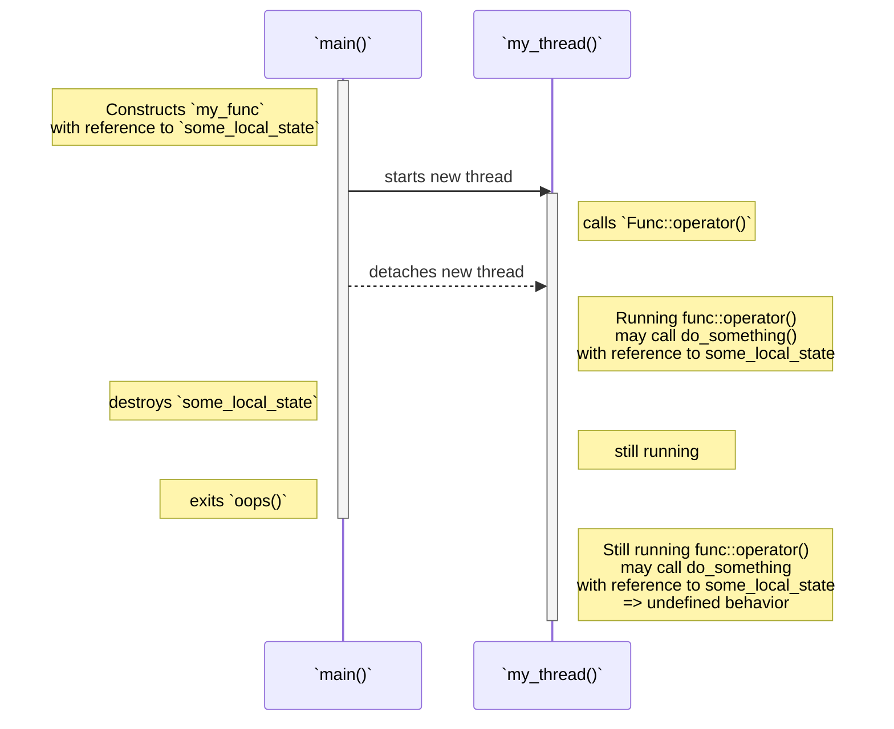

# C++ Concurrency in Action (2nd Edition)

## Highlights from Chapter 02 - "Managing threads"

### Most-vexing parse
> _"If you pass a temporary rather than a named variable, the syntax can be the same as that of a function declaration, in which case the compiler interprets it as such, rather than an object definition"_ – pg. 18, e.g. ...

```cpp
// declares a my_thread function that takes a single parameter...
// ...(of type pointer-to-a-function-taking-no-parameters-and-returning-a-background_task-object)...
// ...and returns a std::thread object, rather than launching a new thread
❌: std::thread my_thread(background_task());
```
```
Parentheses were disambiguated as a function declaration
Member reference base type 'std::thread (background_task (*)())' is not a structure or union
```
This can be _circumnavigated_ by using either extra surrounding parentheses or by using the new uniform initialisation syntax aka curly braces.
```cpp
✅: std::thread my_thread( (background_task()) );
✅: std::thread my_thread{background_task()};

// this also works, but wasn't listed in the examples
✅: std::thread my_thread(background_task{});
```
We can avoid the most-vexing parse entirely by using lambda's.
```cpp
✅: std::thread my_thread( [] () { std::cout << "woof\n"; } );
```

#
### Should I stay or should I go?
Plenty of golden nuggets in this book so far.
> _"Once you’ve started your thread, you need to explicitly decide whether to wait for it to finish (`.join()`) or leave it to run on its own (`.detach()`)."_<br>
> _"If you don’t decide before the std::thread object is destroyed, then your programme is terminated (the `std::thread` destructor calls `std::terminate()`)."_<br>
> _"It’s therefore imperative that you ensure that the thread is correctly joined or detached, even in the presence of exceptions."_<br>
> – pg. 18

#
### Accessing a local variable with a detached thread after it has been destroyed
I came across [__Mermaid__]() while trying to look for a simple bar chart markdown - I wasn't successful with the bar chart, but Mermaid seems like a good match for writing out the flow of a multithreaded programme.

[oops.cpp](oops.cpp)

So many important tidbits in these paragraphs - a lot to take in:
> _"One common way to handle this scenario is to make the thread function self-contained and copy the data into the thread rather than sharing the data."_

> _"If you use a callable object for your thread function, that object is copied into the thread, so the original object can be destroyed immediately."_

> _"But you still need to be wary of objects containing pointers or references, ..."_<br/>
> _"In particular, it’s a bad idea to create a thread within a function that has access to the local variables in that function, unless the thread is guaranteed to finish before the function exits."_

> _"Alternatively, you can ensure that the thread has completed execution before the function exits by joining with the thread."_ – pg. 20

#
### ...work in progress
