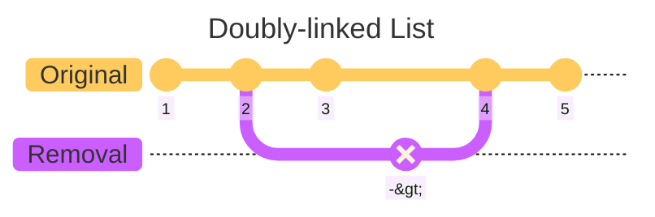
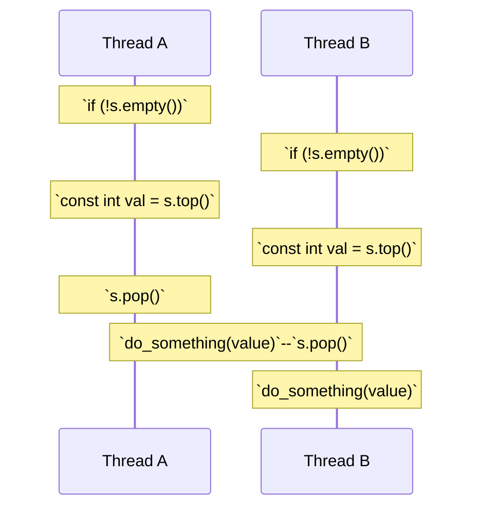

# C++ Concurrency in Action (2nd Edition)

## Highlights from Chapter 03 - "Sharing data between threads"

### Best line of the book
I love an analogy.
> _"Unless you’re particularly friendly, you can’t both use the bathroom at the same time, ..."_ – pg. 36

#
### Invariants
Invariants are statements that hold true about a particular data structure, but which are often broken during an update e.g. the example used in the book uses a doubly-linked list.

Some more [Mermaid magic](https://mermaid.js.org/syntax/gitgraph.html) below.


Whilst already covered in C++ High Performance's chapter on concurrency, it's worth remembering that some extra precautions are needed in order to modify objects / elements in a thread-safe manner.
> _"The simplest potential problem with modifying data that's shared between threads is that of broken invariants."_ – pg. 37

#
### Race conditions (the dreaded undefined behaviour)
Another good analogy - this time with people selling tickets at the cinema without any central reference to stop them from double-booking the same seat (love an analogy).

#
### Avoiding race conditions
* wrap your data structure with a protective mechanism
* lock-free programming (difficult to get right)
* handle the updates to the data structure as a transaction ([software transactional memory](https://en.wikipedia.org/wiki/Software_transactional_memory))

#
### `std::mutex`
I wasn't aware `std::mutex` had a `.lock()` and `.unlock()` function, but now it makes more sense why you would want to wrap mutexes in their scopes - RAII means you won't accidentally forget to call `.unlock()`, and it also protects you from exceptions).

[mutex.cpp](mutex.cpp)

I'll be honest, though - the example is a bit keek.

Yes, we use a `std::mutex` and a `std::lock_guard`, but there's no concurrency (nor any need for it, for that matter, in this example) - I'm yet to test it, but my gut says you'd be better off writing the programme sequentially...

>_", ...in the majority of cases it’s common to group the mutex and the protected data together in a class..."_ — pg. 42

We must be mindful of member functions that return a pointer or a reference to our ptoected data, as well as making sure those functions dont pass pointers or references into other functions (in particular, functions supplied at runtime).

>_"Any code that has access to that pointer or reference can now access (and potentially modify) the protected data without locking the mutex."_ — pg. 42

The author leaves us with some parting words on guidelines conducive to helping us steer clear from the pitfalls mentioned above:
> _"Don’t pass pointers and references to protected data outside the scope of the lock, whether by returning them from a function, storing them in externally visible memory, or passing them as arguments to user-supplied functions."_ – pg. 43

#
### Race conditions
The author uses `std::stack` as an example regarding functions that return references in the lead up to how we might go about avoiding race conditions.

[stack_draft.h](stack_draft.h)

It is again, though, half-baked, with only declarations, and their call to...
```cpp
stack<int> s;
```
...on page 45 will not compile due to the lack of a default constructor.

I've filled in the blanks with inspiration from the standard library and given an albeit basic, but more contextual response of the stack and its member functions in use (instead of a blank `main()` function with no definitions).

[stack_full.cpp](stack_full.cpp)
 
Plenty of theory on race conditions - only real example on a less conspicuous issue would be like below.



#
### Potential workarounds
1) Pass in a reference (after all of the last talk on avoiding them! 😅)
```cpp
std::vector<int> result;
istk.pop(result);
```
2) Require a no-throw copy / move constructor
```cpp
// compile-time detection
std::is_nothrow_copy_constructible<T>;
std::is_nothrow_move_constructible<T>;
```
3) Return a pointer to the popped item (again, after the last warnings? must be something unrelated)
>_"The advantage here is that pointers can be freely copied without throwing an exception, ..."_ – pg. 48

The author suggests using a `std::shared_ptr` for the purpose of avoiding memory leaks. Made me chuckle though, as there's a CPPCon talk [here](https://youtu.be/lkgszkPnV8g?t=1257) dedicated to whether or not `std::shared_ptr<T>` is thread-safe (great talk).

The author suggests choosing option 1 with either option 2 or 3, and includes an example of what a draft of how that might look, as well as a fleshed-out version (I'll just include the fleshed-out version for now).

I have made a few tweaks to get it to compile (another instance of half-baked code, with the `what()` exception being only a function declaration), and have moved the class into its own namespace to tidy up how it's called during the `main()` function. At some point I'll have to benchmark the speed difference between running 100 pops / pushes on one thread compared to using the mutexes.

[threadsafe_stack.cpp](threadsafe_stack.cpp)

#
### Deadlocks
> _"This is almost the opposite of a race condition: rather than two threads racing to be first, each one is waiting for the other, so neither makes any progress."_ - pg. 50

Have to give it to the author - some great analogies involving kids fighting over a toy.

> _"The common advice for avoiding deadlock is to always lock the two mutexes in the same order: if you always lock mutex A before mutex B, then you’ll never deadlock."_ – pg. 51

We can also use `std::lock()` on the off-chance that we need to lock more than one mutex at once without risk of deadlock - I've demonstrated this before in [C++ High Performance](https://github.com/ITHelpDec/CPP-High-Performance/blob/2e61864d92c2981af90dfb536b6b318e18746e36/Chapter%2011%20-%20Concurrency/money_transfer.cpp#L15), but have included the exmaple from the book below.

[lock.cpp](lock.cpp)

Bit of a weird architecture with this one (again, half-baked), using a friend as a public member, and a swap with calls itself explicitly instead of just swapping itself implicitly with `other`, e.g. ...
```cpp
lhs.swap(lhs, rhs); // seems strange
lhs.swap(rhs); // a little better, but still weird
```
`std::adopt_lcok` is an interesting argument as part of the `std::lock_guard` constructor that takes ownership of the already-locked mutex from `std::lock()` instead of attempting to lock the mutex on construction (apparently it helps protect against thrown exceptions - pg. 52).

Also, as of C++17...

https://github.com/ITHelpDec/CPP-Concurrency-in-Action/blob/28605c59c0d391d85bba9718183388f4a5f64b8f/Chapter%2003%20-%20Sharing%20data%20between%20threads/lock.cpp#L21-L32

...coudl be rewritten as...
```cpp
void swap(X &lhs, X &rhs)
{
    if (&lhs == &rhs) { return; }
    
    // std::lock(lhs.m, rhs.m);
    // std::lock_guard<std::mutex> lock1(lhs.m, std::adopt_lock);
    // std::lock_guard<std::mutex> lock2(rhs.m, std::adopt_lock);

    std::scoped_lock guard(lhs.m, rhs.m);
    
    ::swap(lhs.some_detail_, rhs.some_detail_);
 }
```
#
### The golden rule of avoiding deadlocks
> _"...; don’t wait for another thread if there’s a chance it’s waiting for you."_ – pg. 53

* Avoid nested locks
> _"don’t acquire a lock if you already hold one"_ – pg. 53
* Avoid user-supplied code while holding a mutex
* Acquire locks in a fixed order (e.g. one-way linked list vs bi-directional)
* Use a lock heirarchy (divide the application into layers)

[hierarchical_mutex.cpp](hierarchical_mutex.cpp)

We can allow `hierarchical_mutex` to be used in `std::lock_guard<T>` by ensuring it satisfies the three essential mutex members.
* `lock()`
* `unlock()`
* `try_lock()` (mutex locked elsewhere? return `false`)

#
### Nota bene
> _", ...deadlock doesn’t only occur with locks; it can occur with any synchronization construct that can lead to a wait cycle."_ – pg. 59

It's a bad idea to wait for a thread while holding a lock (that thread might need to acquire the lock in order to proceed) – if you need to wait for a thread, try a hierarchy; a simple way to do this is to ensure your threads are joined in the same function that started them (pg. 59).

#
### `std::unique_lock()`
Described in the book as a kind of middleman object (don't lock the mutex, lock the lock!), which might or might not own the mutex at that point in time.

Below we see a comparison between `std::lock_guard` and `std::unique_lock`, with a change of secondary arguments from `std::adopt_lock` to `std::defer_lock` (where `std::adopt_lock` locks the mutex on construction, `std::defer_lock` leaves the mutex unlocked on construction).

| `std::lock_guard` | `std::unique_lock` |
| --- | --- |
| https://github.com/ITHelpDec/CPP-Concurrency-in-Action/blob/4b3b92b3ea943a80a8c41b26ec36e43809c0acb4/Chapter%2003%20-%20Sharing%20data%20between%20threads/lock.cpp#L21-L28 | https://github.com/ITHelpDec/CPP-Concurrency-in-Action/blob/16c00f650b04125fbf3f1f9acb8cca4dba441107/Chapter%2003%20-%20Sharing%20data%20between%20threads/lock.cpp#L21-L28 |

**N.B.**
> _"If the instance does own the mutex, the destructor must call unlock(), and if the instance does not own the mutex, it must not call unlock()."_ – pg. 60

We can query the flag that that indicates whether the mutex is owned through the `owns_lock()` member function.

The consensus from the book seems to be that unless you intend to transfer lock ownership, `std::scoped_lock` from C++17 seems to be the better shout.

It's also worth noting that we should explicitly call `std::move` when passing real values / references (i.e. lvalues) to `std::unique_lock` (rvalues are spoken for) in order to take advantage of move semantics.

> _"; ...holding a lock for longer than required can cause a drop in performance, because other threads waiting for the lock are prevented from proceed- ing for longer than necessary."_ – pg. 61

#
### Lock granularity
> _": ...the lock granularity is a hand-waving term to describe the amount of data protected by a single lock.<br/>A fine-grained lock protects a small amount of data, and a coarse-grained lock protects a large amount of data."_ – pg. 62

#
### Try not to do file I/O while holding a lock
> _"File I/O is typically hundreds (if not thousands) of times slower than reading or writing the same volume of data from memory."_ – pg. 62

`std::unique_lock` seems to be very useful for instances where locking the mutex isn't required for the entirety of the function - just when we need to interact with a shared resource (with `.lock()` / `.unlock()`).

Don't be that person that holds up the shopping queue at Tesco's...

#
### Gotcha
Be mindful of operations where variables might change between reads e.g. whilst the values are locked in individually for `lhs` and `rhs`, there is a chance that the two values could have been changed between the two reads.

<details>
<summary><code>lhs == rhs?</code> <i>(click to expand / collapse)</i></summary>

```cpp
#include <mutex>

class Y {
public:
    Y(int sd) : some_detail(sd) { }
    
    friend bool operator==(const Y &lhs, const Y &rhs)
    {
        if (&lhs == &rhs) { return true; }
        const int lhs_value = lhs.get_detail();
        const int rhs_value = rhs.get_detail();
        return lhs_value == rhs_value;
    }
private:
    int some_detail;
    mutable std::mutex m;
    
    int get_detail() const
    {
        std::lock_guard<std::mutex> lock_a(m);
        return some_detail;
    }
};
```

</details>
   
The key takeaway here is...
> _"if you don’t hold the required locks for the entire duration of an operation, you’re exposing yourself to race conditions"_ – pg. 64

#
### ...work in progress
