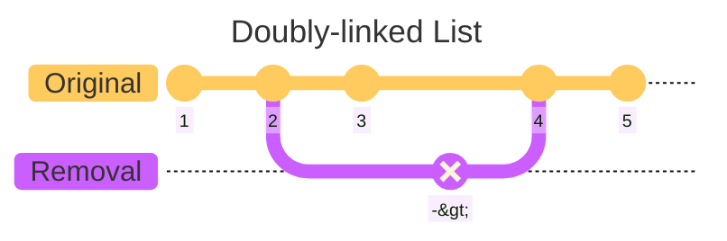

# C++ Concurrency in Action (2nd Edition)

## Highlights from Chapter 03 - "Sharing data between threads"

### Best line of the book
I love an analogy.
> _"Unless you’re particularly friendly, you can’t both use the bathroom at the same time, ..."_ – pg. 36

#
### Invariants
Invariants are statements that hold true about a particular data structure, but which are often broken during an update e.g. the example used in the book uses a doubly-linked list.

Some more [Mermaid magic](https://mermaid.js.org/syntax/gitgraph.html) below.

#
### ...work in progress
