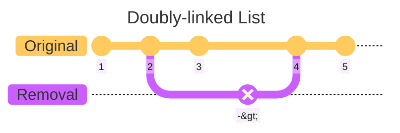
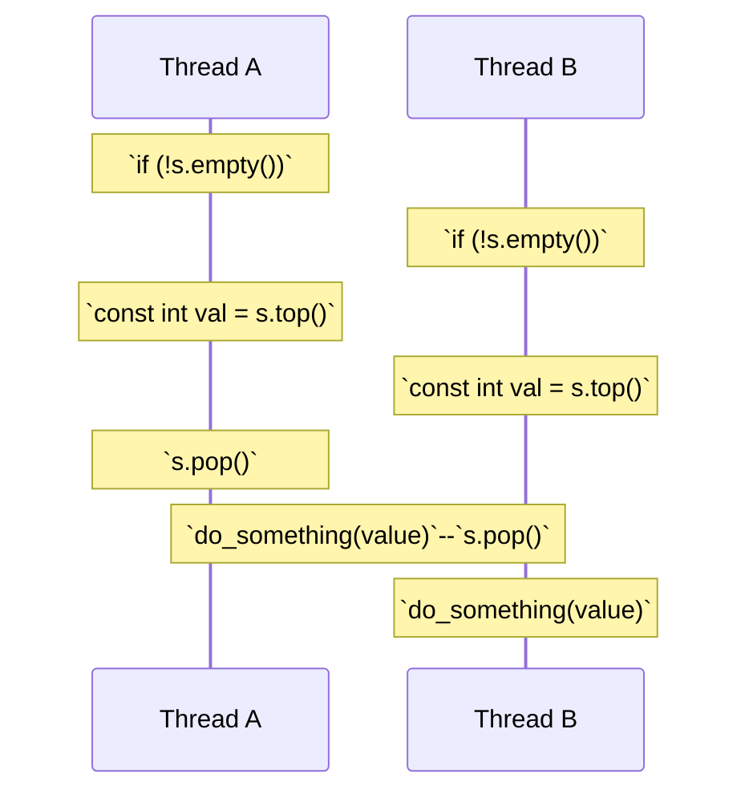

# C++ Concurrency in Action (2nd Edition)

## Highlights from Chapter 03 - "Sharing data between threads"

### Best line of the book
I love an analogy.
> _"Unless you’re particularly friendly, you can’t both use the bathroom at the same time, ..."_ – pg. 36

#
### Invariants
Invariants are statements that hold true about a particular data structure, but which are often broken during an update e.g. the example used in the book uses a doubly-linked list.

Some more [Mermaid magic](https://mermaid.js.org/syntax/gitgraph.html) below.


Whilst already covered in C++ High Performance's chapter on concurrency, it's worth remembering that some extra precautions are needed in order to modify objects / elements in a thread-safe manner.
> _"The simplest potential problem with modifying data that's shared between threads is that of broken invariants."_ – pg. 37

#
### Race conditions (the dreaded undefined behaviour)
Another good analogy - this time with people selling tickets at the cinema without any central reference to stop them from double-booking the same seat (love an analogy).

#
### Avoiding race conditions
* wrap your data structure with a protective mechanism
* lock-free programming (difficult to get right)
* handle the updates to the data structure as a transaction ([software transactional memory](https://en.wikipedia.org/wiki/Software_transactional_memory))

#
### `std::mutex`
I wasn't aware `std::mutex` had a `.lock()` and `.unlock()` function, but now it makes more sense why you would want to wrap mutexes in their scopes - RAII means you won't accidentally forget to call `.unlock()`, and it also protects you from exceptions).

[mutex.cpp](mutex.cpp)

I'll be honest, though - the example is a bit keek.

Yes, we use a `std::mutex` and a `std::lock_guard`, but there's no concurrency (nor any need for it, for that matter, in this example) - I'm yet to test it, but my gut says you'd be better off writing the programme sequentially...

>_", ...in the majority of cases it’s common to group the mutex and the protected data together in a class..."_ — pg. 42

We must be mindful of member functions that return a pointer or a reference to our ptoected data, as well as making sure those functions dont pass pointers or references into other functions (in particular, functions supplied at runtime).

>_"Any code that has access to that pointer or reference can now access (and potentially modify) the protected data without locking the mutex."_ — pg. 42

The author leaves us with some parting words on guidelines conducive to helping us steer clear from the pitfalls mentioned above:
> _"Don’t pass pointers and references to protected data outside the scope of the lock, whether by returning them from a function, storing them in externally visible memory, or passing them as arguments to user-supplied functions."_ – pg. 43

#
### Race conditions
The author uses `std::stack` as an example regarding functions that return references in the lead up to how we might go about avoiding race conditions.

[stack_draft.h](stack_draft.h)

It is again, though, half-baked, with only declarations, and their call to...
```cpp
stack<int> s;
```
...on page 45 will not compile due to the lack of a default constructor.

I've filled in the blanks with inspiration from the standard library and given an albeit basic, but more contextual response of the stack and its member functions in use (instead of a blank `main()` function with no definitions).

[stack_full.cpp](stack_full.cpp)
 
Plenty of theory on race conditions - only real example on a less conspicuous issue would be like below.



#
### Potential workarounds
1) Pass in a reference (after all of the last talk on avoiding them! 😅)
```cpp
std::vector<int> result;
istk.pop(result);
```
2) Require a no-throw copy / move constructor
```cpp
// compile-time detection
std::is_nothrow_copy_constructible<T>;
std::is_nothrow_move_constructible<T>;
```
3) Return a pointer to the popped item (again, after the last warnings? must be something unrelated)
>_"The advantage here is that pointers can be freely copied without throwing an exception, ..."_ – pg. 48

The author suggests using a `std::shared_ptr` for the purpose of avoiding memory leaks. Made me chuckle though, as there's a CPPCon talk [here](https://youtu.be/lkgszkPnV8g?t=1257) dedicated to whether or not `std::shared_ptr<T>` is thread-safe (great talk).

The author suggests choosing option 1 with either option 2 or 3, and includes an example of what a draft of how that might look, as well as a fleshed-out version (I'll just include the fleshed-out version for now).

[threadsafe_stack.cpp](threadsafe_stack.cpp)

#
### ...work in progress
