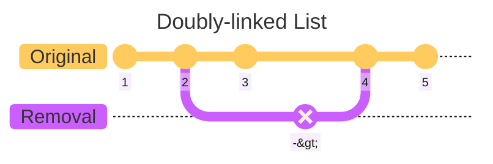

# C++ Concurrency in Action (2nd Edition)

## Highlights from Chapter 03 - "Sharing data between threads"

### Best line of the book
I love an analogy.
> _"Unless you’re particularly friendly, you can’t both use the bathroom at the same time, ..."_ – pg. 36

#
### Invariants
Invariants are statements that hold true about a particular data structure, but which are often broken during an update e.g. the example used in the book uses a doubly-linked list.

Some more [Mermaid magic](https://mermaid.js.org/syntax/gitgraph.html) below.

Whilst already covered in C++ High Performance's chapter on concurrency, it's worth remembering that some extra precautions are needed in order to modify objects / elements in a thread-safe manner.
> _"The simplest potential problem with modifying data that's shared between threads is that of broken invariants."_ – pg. 37

#
### Race conditions (the dreaded undefined behaviour)
Another good analogy - this time with people selling tickets at the cinema without any central reference to stop them from double-booking the same seat (love an analogy).

#
### Avoiding race conditions
* wrap your data structure with a protective mechanism
* lock-free programming (difficult to get right)
* handle the updates to the data structure as a transaction ([software transactional memory](https://en.wikipedia.org/wiki/Software_transactional_memory))

#
### `std::mutex`
I wasn't aware `std::mutex` had a `.lock()` and `.unlock()` function, but now it makes more sense why you would want to wrap mutexes in their scopes - RAII means you won't accidentally forget to call `.unlock()`, and it also protects you from exceptions).

[mutex.cpp](mutex.cpp)

I'll be honest, though - the example is a bit keek.

Yes, we use a `std::mutex` and a `std::lock_guard`, but there's no concurrency (nor any need for it, for that matter, in this example) - I'm yet to test it, but my gut says you'd be better off writing the programme sequentially...

>_", ...in the majority of cases it’s common to group the mutex and the protected data together in a class..."_ — pg. 42

We must be mindful of member functions that return a pointer or a reference to our ptoected data, as well as making sure those functions dont pass pointers or references into other functions (in particular, functions supplied at runtime).

>_"Any code that has access to that pointer or reference can now access (and potentially modify) the protected data without locking the mutex."_ — pg. 42

#
### ...work in progress
