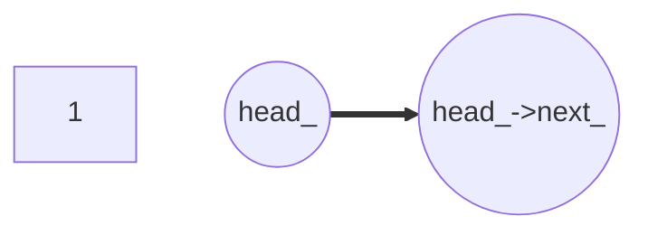
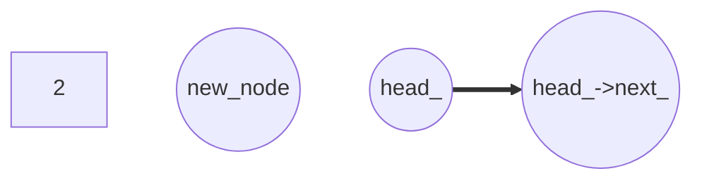
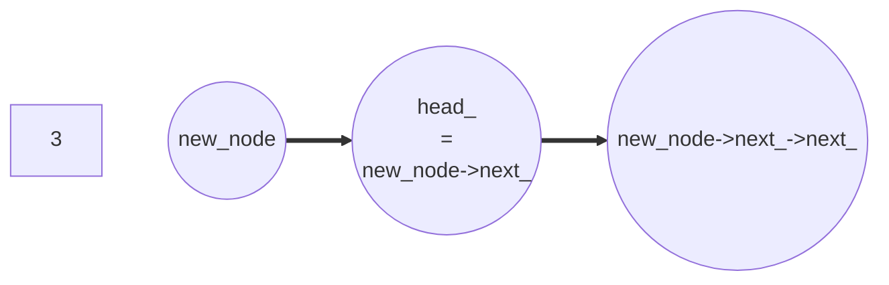
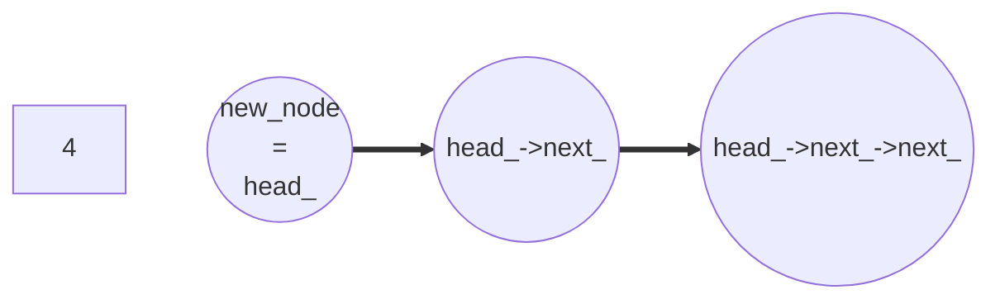

# C++ Concurrency in Action (2nd Edition)

## Highlights from Chapter 07 - "Designing lock-free concurrent data structures"

### Mutexes
> _"Mutexes are powerful mechanisms for ensuring that multiple threads can safely access a data structure without encountering race conditions or broken invariants."_ – pg. 205

#
### Definitions and consequences
> _"Algorithms and data structures that use mutexes, condition variables, and futures to synchronise the data are called blocking data structures and algorithms."_ – pg. 206

> _"Data structures and algorithms that don’t use blocking library functions are said to be non-blocking. Not all these data structures are lock-free, though, ..."_ – pg. 206

[spinlock_mutex.cpp](../Chapter%2005%20-%20The%20C++%20memory%20model%20and%20operations%20on%20atomic%20types/spinlock_mutex.cpp)

#### Obstruction-Free
> _"If all other threads are paused, then any given thread will complete its operation in a bounded number of steps."_ – pg. 207

#### Lock-Free
> _"If multiple threads are operating on a data structure, then after a bounded number of steps one of them will complete its operation."_ – pg. 207

#### Wait-Free
> _"Every thread operating on a data structure will complete its opera- tion in a bounded number of steps, even if other threads are also operating on the data structure."_ – pg. 207

#
### Lock-free data structures
> _"For a data structure to qualify as lock-free, more than one thread must be able to access the data structure concurrently."_ – pg. 207

> _"...if one of the threads accessing the data structure is suspended by the scheduler midway through its operation, the other threads must still be able to complete their operations without waiting for the suspended thread."_ – pg. 207

> _"If another thread performs operations with the “wrong” timing, the other thread might make progress but the first thread continually has to retry its operation. Data structures that avoid this problem are wait-free as well as lock-free."_ – pg. 207

#
### Wait-free data structures
> _"A wait-free data structure is a lock-free data structure with the additional property that every thread accessing the data structure can complete its operation within a bounded number of steps, regardless of the behavior of other threads."_ – pg. 208

> _"The scheduling of threads by the OS may mean that a given thread can loop an exceedingly large number of times, but other threads loop very few times. These operations are thus not wait-free."_ – pg. 208

#
### Does the benefit outweigh the cost?
> _"With a lock-free data structure, some thread makes progress with every step."_ – pg. 208

>  _"With a wait-free data structure, every thread can make forward progress, regardless of what the other threads are doing; there's no need for waiting."_ – pg. 208

This is very important!

> _"If a thread dies while holding a lock, that data structure is broken **forever**."_ – pg. 208

> _"To avoid the undefined behavior associated with a data race, you must use atomic operations for the modifications...\[and\]...you must ensure that changes become visible to other threads in the cor- rect order."_ – pg. 208

#
### Live locks (as opposed to deadlocks)
A live lock is like [the chopstick scene from Kung Fu Panda](https://www.google.com/url?sa=t&rct=j&q=&esrc=s&source=web&cd=&cad=rja&uact=8&ved=2ahUKEwip_oH4xpj_AhUMB8AKHYFpBQ8QtwJ6BAgHEAI&url=https%3A%2F%2Fwww.youtube.com%2Fwatch%3Fv%3DBE1zdZYqovQ&usg=AOvVaw09RiB4FOyjzsPEDh0njpJq) - two threads or more are trying to act on the same object at once, but unless one concedes to the other, they will continue to clash.

> _"By definition, wait-free code can’t suffer from live lock because there’s always an upper limit on the number of steps needed to perform an operation."_ – pg. 209

> _", ...the cache ping-pong associated with multiple threads accessing the same atomic variables can be a significant performance drain."_ – pg. 209

> _"On some platforms, what appears to be lock-free code might be using locks internal to the C++ Standard Library implementation"_ – pg. 210

#
### A lock-free stack
Nodes are retrieved in the reverse order they were added (LIFO - Last In, First Out).

The simplest stack is a linked list - adding a node is as follows:
1) Create a new node
2) Set its next pointer to the current head node
3) Set the head node to point to it

...although the potential for a race condition lies between steps 2 and 3.

> _"It’s therefore vital that your new node is thoroughly prepared before head is set to point to it; you can’t modify the node afterward."_ – pg. 210

[lock_free_stack.cpp](lock_free_stack.cpp)

A trickier example to play around with, this one - I found it odd that this example strayed away from the heavy use of smart pointers, but reading further on into the book we see talk of memory leaks and reclamation.

I made a few tweaks - perfect-forwarding for `.push(D &&data)`, a barrier to synchronise the threads before pushing both lvalues and rvalues to see if it would produce any synchronisation errors, and then a simple traverse-a-linked-list `.print()` function, although I wonder if this needs to be handled atomically like `.push()` in case the data structure is being modified while it's being read.

#### ADDENDUM
Whilst `std::atomic<std::shared_ptr<T>>` might not be a fully-accepted thing yet, `std::atomic_load(std::shared_ptr<T>)` looks to be valid from at least C++11 according to Fedor Pikus' talk at [27:28](https://youtu.be/9hJkWwHDDxs?t=27m28s) (definitely worth a watch).

#
### Push with diagrams
Good old mermaid to the rescue!









#
### `compare_exchange_weak(...)`
This is a pretty cool feature of `compare_exchange_weak()`:
> _"...if it returns false to indicate that the comparison failed (for example, because `head_` was modified by another thread), the value supplied as the first parameter (`new_node->next_`) is updated to the current value of `head_`."_ – pg. 211

> _"Because you build the data to be stored as part of the node, and you use `.compare_exchange_weak()` to update the `head_` pointer, there are no problematic race conditions here."_

#
### Leaky pop
1) Read the current value of head
2) Read `head_->next_`
3) Set `head_` to `head_->next_`
4) Return the data from the retrieved node
5) Delete the retrieved node

The tricky part is if one thread is at step 5 before the other gets to step 2 and tries to dereference a dangling pointer - we'll leave step 5 for later on.

Another doozy is if two threads read the same value of `head_` they will return the same node - `.compare_exchange_weak()` comes to the rescue again, failing when either a new node has been pushed or another thread has popped the node you were trying to pop.

[leaky_stack.cpp](leaky_stack.cpp)

There are a few more gotchas with this example.

Firstly, I don't agree with the following statement:
> _"...if `head_` is a null pointer, it will cause undefined behavior as it tries to read the next pointer. **<ins>This is easily fixed by checking for `nullptr` in the while loop</ins>**"_ – pg. 212

It doesn't matter if I write `if (!head_)`, `if (!old_head)` or `if (!old_head->next_)` in the body of the loop - all of these checks will throw for bad access if we encounter a race condition, although a few pages further on we see the other include a node check inside the condition check of the while statement, not the body of the loop.

This still doesn't work for our `void pop(T &val)` function, unfortunately - I have only managed to get it to work when checking for an empty node at the beginning of the function.

Typically, it is more common to check if a container is empty at the _**start**_ of the operation (i.e. before we perform any operations on a `nullptr`).

My one question here is - do we perform the same
...
```cpp
if (!head_) { return std::shared_ptr<T>(); }
```
...check (like we do in our other `.pop()` function), or do we follow the example? I almost want to side with the early-exit check, because the likes of `.compare_exchange_weak()` will only return false when someone else has beat you to the chase.

I know I'm making a habit of this, but I've raised a PR [here](https://github.com/anthonywilliams/ccia_code_samples/pull/36) with a better rationale for anyone that might be interested - given the inaction of the other PR's, there's a high chance nothing will happen, but hopefully future readers might find it beneficial (myself included, especially if I find out I've made a mistake!).

I also came up with (what I hope) is an atomic way of printing our container (using `.pop()` as inspiration), although, again, I wonder if it's even necessary, so feedback is welcome.

https://github.com/ITHelpDec/CPP-Concurrency-in-Action/blob/9e0806110e42c5f78ab325c620edc5688aa3b1ba/Chapter%2007%20-%20Designing%20lock-free%20concurrent%20data%20structures/leakier_stack.cpp#L33-L40

[leakier_stack.cpp](leakier_stack.cpp)

### ...work in progress
#
### If you've found anything from this repo useful, please consider contributing towards the only thing that makes it all possible – my unhealthy relationship with 90+ SCA score coffee beans.

<a href="https://www.buymeacoffee.com/ITHelpDec"></a>
